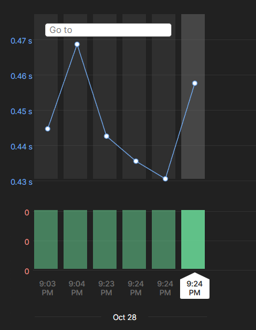

# 📘 Simple Books API – Postman Automation Project


A complete **API Testing Project** built in **Postman** for the [Simple Books API](https://github.com/vdespa/introduction-to-postman-course/blob/main/simple-books-api.md). 
This project demonstrates **real-world API testing** including CRUD operations, authentication, negative testing, automation using **Newman**, and scheduled execution using **Postman Monitors**.

---

## 🚀 Overview

**Goal:** To validate and automate end-to-end workflows of the Simple Books REST API. 
The project covers:

* Full CRUD lifecycle for book orders
* Automated Bearer token authentication
* Dynamic variable generation and chaining
* Functional and negative testing scenarios
* Automated collection execution and reporting

---

## 🧩 API Modules Tested

| Module | Endpoint | Methods | Description |
| :--- | :--- | :--- | :--- |
| **Health Check** | `/status` | GET | Verify API availability |
| **Authentication** | `/api-clients` | POST | Register client and retrieve token |
| **Books** | `/books`, `/books/:id` | GET | Fetch list or details of books |
| **Orders** | `/orders`, `/orders/:id` | POST, GET, PATCH, DELETE | Manage book orders end-to-end |

---

## 🧪 Test Coverage

### ✅ Functional Tests

* API status returns `200 OK`
* Successful client registration and token generation
* Retrieve available books
* Create, retrieve, update, and delete an order

### ❌ Negative Tests

* Registering a duplicate client (expect 409)
* Retrieving deleted order (expect 404)
* Accessing endpoints without valid token (expect 401)

---

## 🧰 Environment Variables

| Variable | Purpose |
| :--- | :--- |
| `baseURL` | Base URL for API (`https://simple-books-api.click`) |
| `clientName` | Randomly generated client name |
| `clientEmail` | Dynamic email derived from client name |
| `accessToken` | Token obtained after registration |
| `bookId` | Book ID retrieved dynamically |
| `orderId` | Captured from newly created order |

> 💡 Tokens and IDs are stored dynamically using Postman scripts during collection execution.

---

## 🧱 Collection Structure

📁 Simple Books API
┣ 📂 Health Check
┃ ┗ GET /status
┣ 📂 Auth
┃ ┣ POST /api-clients (Register)
┃ ┗ POST /api-clients (Duplicate User Test)
┣ 📂 Books
┃ ┣ GET /books
┃ ┗ GET /books/:id
┗ 📂 Orders
┣ POST /orders
┣ GET /orders
┣ GET /orders/:id
┣ PATCH /orders/:id
┣ DELETE /orders/:id
┗ GET /orders/:id (Deleted Order Test)
---

## ⚙️ Run Using Newman

Execute the entire collection from CLI:

```bash
newman run postman/SimpleBooksAPI_Collection.json \
  -e postman/SimpleBooksAPI_Environment.json \
  -r cli,html \
  --reporter-html-export reports/newman-report.html
```

✔ Runs all tests sequentially (Health → Auth → Books → Orders)

📄 Generates an HTML report under `/reports/newman-report.html`

📊 Postman Monitor Overview
Automated Postman Monitors are configured to run every 12 hours to validate uptime and performance.
Below is a snapshot of the monitor performance over multiple runs:



🧠 Highlights & Key Learnings
* Implemented dynamic variable chaining using Postman scripts
* Automated access token generation and secure variable handling
* Built data-driven tests with assertions and conditions
* Integrated Newman HTML reports for continuous monitoring
* Configured Postman Monitor for scheduled validation of API uptime

---

## 📁 Project Files

| File | Description |
| :--- | :--- |
| `postman/SimpleBooksAPI_Collection.json` | Full Postman collection with test scripts |
| `postman/SimpleBooksAPI_Environment.json` | Environment variables (URLs, tokens, IDs) |
| `reports/newman-report.html` | Newman HTML test report |
| `screenshots/monitor_run_passed.png` | Screenshot of successful monitor run |

---


## 👤 Author
**Aditya More**                                                                                                                                                    
💻 Full-Stack & QA Automation Enthusiast                                                                                                                           
📧 adityamore.se@example.com
